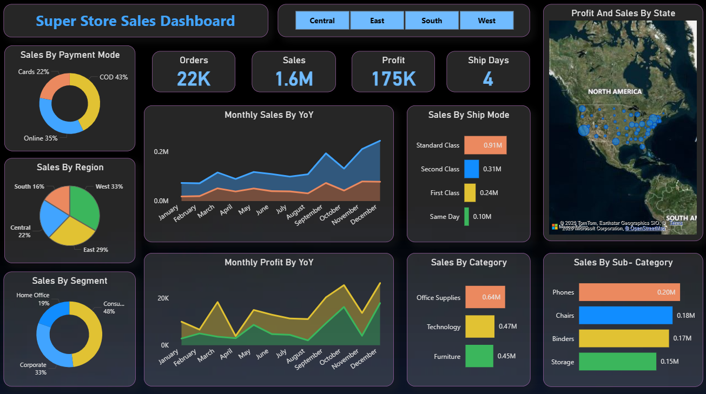
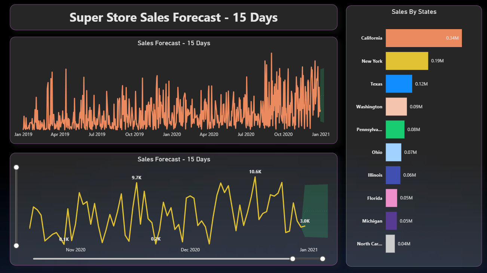

# 📊 SuperStore Sales Analysis & Forecast Dashboard (Power BI)

## 📌 Project Overview

This project presents an **interactive Power BI dashboard** built using the Superstore dataset.
The dashboard analyzes **sales performance, profit trends, customer segments, and regional performance**.
It also includes a **15-day sales forecasting model** to predict future sales trends based on historical data.

---

# 📷 Dashboard Screenshots

## 1️⃣ Sales Performance Dashboard

This dashboard provides a complete overview of sales performance across different categories, regions, and segments.

### 🔹 Key Metrics

* 📦 **Total Orders:** 22K
* 💰 **Total Sales:** 1.6M
* 📈 **Total Profit:** 175K
* 🚚 **Average Ship Days:** 4

### 🔹 Insights Provided

* 💳 Sales by **Payment Mode**
* 🌍 Sales by **Region**
* 👥 Sales by **Customer Segment**
* 📊 **Monthly Sales Trend**
* 📉 **Monthly Profit Trend**
* 🛍️ Sales by **Category & Sub-Category**
* 🗺️ **State-wise Sales Distribution**

---

## 🔮 Sales Forecast Dashboard

This dashboard predicts **future sales trends for the next 15 days** using historical sales data.

### 🔹 Forecast Insights

* 📈 Historical sales trend analysis
* 🔮 **15-day sales prediction**
* 📊 State-wise sales comparison
* 📉 Identification of sales patterns and demand trends

---

# 🛠️ Tools & Technologies Used

* 📊 **Power BI**
* 🧮 **DAX (Data Analysis Expressions)**
* 📂 **Data Modeling**
* 📉 **Time Series Forecasting**
* 📑 **Data Visualization**

---

# 📊 Key Business Insights

* 📌 **December recorded the highest sales**
* 🚚 **Standard Class** is the most used shipping mode
* 🏢 **Office Supplies** generated the highest sales
* 📱 **Phones** is the best performing sub-category
* 🌎 **California** has the highest sales among all states

---

# 🎯 Project Outcome

This dashboard helps businesses **monitor sales performance, identify trends, and make data-driven decisions**.
The **forecasting model** enables companies to predict future sales and improve planning strategies.

---

# ⭐ Author

**Abhishek Memane**

## 📬 Reach Me
📧 **Email:** [abhimemane7272@gmail.com](mailto:abhimemane7272@gmail.com)
💼 **LinkedIn:** [Abhishek Memane](https://www.linkedin.com/in/abhishek-memane-5b609238a)
🐙 **GitHub:** [abhishekmemane72](https://github.com/abhishekmemane72)
📍 **Location:** Maharashtra, India

